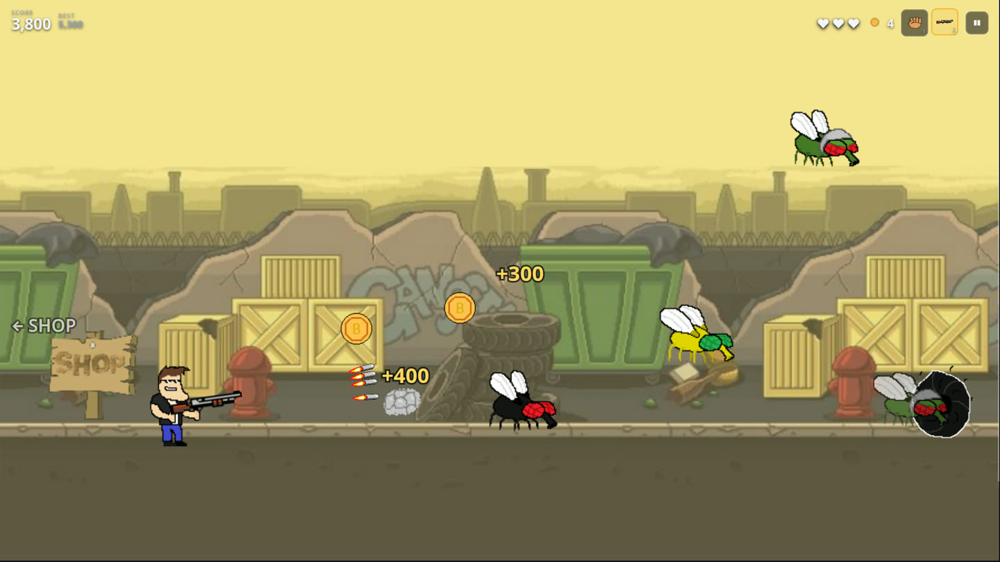

# Flygame

A small browser arcade game: flies swarm you, you squash them by jumping on their
heads, and their gold buys you something louder.

**[▶ Play it](https://simonprato.github.io/flygame/)** — no install, no dependencies, works on a phone.



---

## About

This started as one of my first coding projects, written as a kid: a single
1,477-line `index.html` with the whole game — art references, physics, shop,
sound — inside one `<script>` tag. It worked, which at the time was the point.

The game design, the artwork, and every sprite are unchanged. What got rebuilt is
everything underneath: the loop, the input handling, the asset loading, and the
interface. The original is preserved and still playable in
[`legacy/`](legacy/index.html).

## How to play

Flies come in from the right. Land on one from above and it pops; touch one any
other way and it costs you a heart. Gold flies drop coins. Walk off the left edge
to reach the shop, and spend the coins on a shotgun or a fire axe.

Chaining kills without touching the ground stacks a score multiplier up to 5×.
Past 1,500 points the bombers show up, and they do not come down to your level —
that is what the shotgun is for.

| Action | Keys |
| --- | --- |
| Move | `A` `D` or `←` `→` |
| Jump | `Space`, `W` or `↑` (hold longer to jump higher) |
| Attack | Left click, or `J` |
| Switch weapon | Mouse wheel, `1`–`3`, or `Q` / `E` |
| Pause | `Esc` or `P` |
| Mute | `M` |
| Fullscreen | `F` |

On touch devices an on-screen pad appears, and aiming is automatic — the shotgun
tracks the nearest fly. The game asks you to rotate to landscape in portrait,
where a 16:9 stage would collapse to an unplayable strip.

## Running it locally

The game is plain ES modules, which browsers will not load over `file://`, so it
needs any static server:

```sh
python3 -m http.server 8000
# then open http://localhost:8000
```

Opening `index.html` directly shows a note explaining this rather than a blank
page.

## Tests

```sh
node tests/smoke.mjs
```

34 checks covering physics, collisions, the shop, pooling and the state machine.
They run the real game modules against a ~150-line DOM stub, so there is nothing
to install and no browser involved. The stubbed canvas throws when asked to draw
a sprite that does not exist or at a non-finite coordinate, which is the failure
mode the old approach used to hide.

## Layout

```
index.html          page shell: HUD, panels, touch pad
css/style.css       everything you can read or click
src/
  main.js           bootstrap + fixed-timestep loop
  game.js           simulation and canvas rendering
  renderer.js       DPR-aware canvas scaling and letterboxing
  input.js          keyboard / mouse / touch -> game actions
  assets.js         sprite manifest and loader
  audio.js          Web Audio sound effects, streamed music
  ui.js             menus, shop, pause, game over
  config.js         every tunable value
  storage.js        settings and high score
tests/              dependency-free smoke tests
legacy/             the original, preserved
img/  audio/        the artwork and sound, untouched
```

`src/config.js` is the file to open if you want to change how the game feels —
jump height, spawn rates, prices, enemy mix and lives all live there. Setting
`PLAYER.LIVES` to `1` restores the original one-hit-death rules.

## What changed in the rebuild

**The loop.** The original ran `setInterval(fn, 1)` and then called its update
function somewhere between one and thirteen times per tick, chosen by a ladder of
`if (diff >= 222) … else if (diff >= 206) …` branches against
`Date.getMilliseconds()` — a clock that wraps every second, which the code
corrected for by hand. The game therefore ran at a different speed on every
machine. It is now `requestAnimationFrame` with a fixed 1/60 s accumulator, and
all movement is expressed per second, so the simulation is identical at 60 Hz and
at 144 Hz. There is a regression test for exactly this.

**A listener leak.** `window.addEventListener('wheel', …)` sat inside the
per-frame update. Measured on the archived original: **267 listeners added in ten
seconds of play**, all still attached, all firing on every scroll. The rebuilt
version adds **zero** during play — also a measured number.

**Download size.** All four soundtracks (5.5 MB) and every background loaded up
front. Music now streams with `preload="none"`, so only the track you chose is
fetched, and only the one randomly selected background is downloaded. The initial
payload is sprites only.

**Audio.** Each effect was a single `Audio` element, so a second explosion cut off
the first — and `play()` was being called on every frame an explosion was on
screen. Effects now decode once into Web Audio buffers and play as independent
voices, with a per-clip retrigger floor so a burst cannot machine-gun.

**Allocation.** Entities are pre-allocated pools that are reused; the update loop
allocates nothing. Under a deliberately brutal load — enemies, coins and bombs
spawned ten times a second for fifteen seconds while firing continuously, score
past 119,000 — frame time held at a median of 16.66 ms with no pool growth.

**Resolution.** The canvas was fixed at 1890×924 and then resized from
`screen.width` — the physical screen, not the window — with no resize handling
and no device-pixel-ratio awareness. It is now a virtual 1920×1080 stage scaled
and letterboxed to whatever the window is, at up to 2× device pixels, and it
follows the window as you resize it.

**The interface.** The soundtrack picker and the entire shop were invisible
rectangles you had to know the coordinates of, and buying took two clicks on the
same blind spot with a confirm counter. The menus, HUD and shop are now real DOM:
readable at any resolution, keyboard-navigable, screen-reader-labelled, and
honouring `prefers-reduced-motion`.

**Things that were missing.** A pause. A settings screen. A persisted high score.
Coyote time and a jump buffer. Auto-pause when the tab is hidden. Touch controls.
An actual attack for the fire axe — it was purchasable and drawn, but hitting the
button did nothing.

**Bugs fixed along the way.** Enemy spawning wrote past the end of its 8-slot
array, so extra flies silently vanished. `dropCoin` could write to index 8 of an
8-element array. Gold flies always faced right. Grenades froze in mid-air instead
of falling. Knockback could shove you through the shop door. The player turned
permanently invisible on the game-over screen, because the blink was driven by a
timer that stops ticking when the simulation does.

## Credits

Game design and code: me, then and now.

Character and prop sprites (the man, the flies, the coins, the weapons) were made
for the original project. The parallax backgrounds and the shop interior are
third-party asset-pack art — _source to be filled in._

⚠️ **The music is not mine.** The four tracks in `audio/` are the **Soda Dungeon**
soundtrack, downloaded from YouTube when I built this — the original filenames
still say so in the git history. They are kept only so the archived version still
runs. Replace them before reusing anything here, and do not treat their presence
as a licence.

No licence file yet, for that reason: the repository cannot be released as a whole
until the audio and background art are sorted out.
